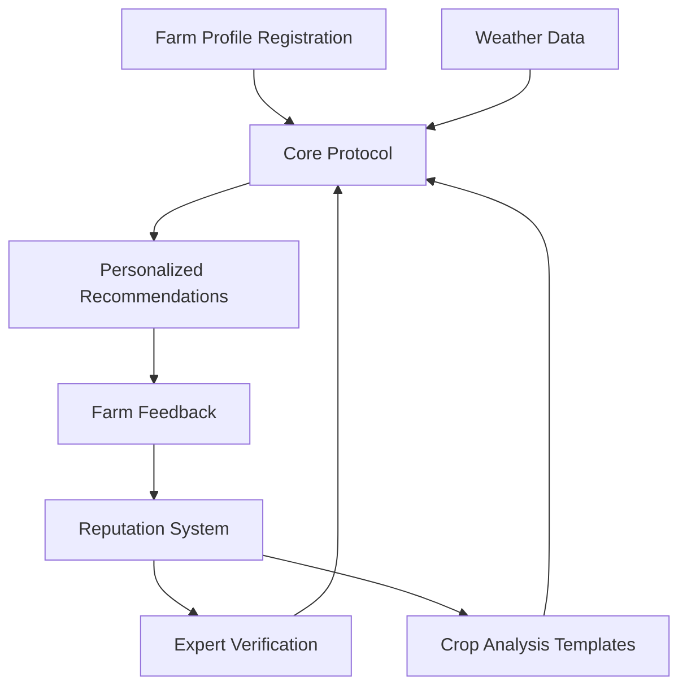

# Farm Scanner: Agricultural Monitoring Platform

A decentralized platform that provides personalized farm management recommendations based on current weather conditions, farm profiles, and expert-created crop analyses.

## Overview

Farm Scanner creates trustless, transparent agricultural insights by combining:
- Farm profiles (crop type, farm size, location)
- Real-time weather data (temperature, humidity, UV index)
- Expert-verified crop analysis templates
- Community feedback and reputation systems

The platform eliminates agricultural guesswork by using verified agricultural experts and maintaining a transparent reputation system based on farm feedback.

## Architecture

The platform consists of several interconnected components:



### Core Components
- **Farm Profiles**: Stores crop types, health metrics, and farm goals
- **Expert Verification**: Manages verified agricultural experts and agronomists
- **Crop Analysis Templates**: Expert-created farm management strategies with weather conditions
- **Recommendation Engine**: Matches farms with strategies based on profiles and weather
- **Feedback System**: Tracks farm ratings and updates expert/analysis reputations

## Contract Documentation

### Farm Scanner Core (`farm-scanner-core.clar`)

The main contract handling all platform functionality:

#### Key Features
- Farm profile management
- Expert verification system
- Crop analysis template creation and management
- Personalized recommendation generation
- Feedback and reputation tracking

#### Access Control
- Contract administrator can verify experts
- Only verified experts can create crop analysis templates
- Farms can only submit feedback for their own recommendations

## Getting Started

### Prerequisites
- Clarinet
- Stacks wallet for testing

### Installation
1. Clone the repository
2. Install dependencies with Clarinet
3. Deploy contracts to local Clarinet chain

### Basic Usage Example
```clarity
;; Register a farm profile
(contract-call? .farm-scanner-core register-farm 
    "wheat" 
    u100 ;; farm size (acres)
    { latitude: 42, longitude: -75 })

;; Generate a recommendation
(contract-call? .farm-scanner-core generate-recommendation 
    25 ;; temperature
    60 ;; humidity
    5  ;; UV index)
```

## Function Reference

### Farm Management
```clarity
(register-farm (crop-type (string-ascii 50)) 
               (farm-size uint)
               (location { latitude: int, longitude: int }))

(update-farm-profile (crop-type (string-ascii 50)) 
                     (farm-size uint)
                     (location { latitude: int, longitude: int }))
```

### Expert Functions
```clarity
(verify-expert (expert principal) 
               (credentials (string-utf8 500)))

(submit-crop-analysis-template (name (string-utf8 100)) 
                               (description (string-utf8 500)) 
                               ...)
```

### Recommendation System
```clarity
(generate-recommendation (temperature int) 
                         (humidity uint) 
                         (uv-index uint))

(submit-feedback (recommendation-id uint) 
                 (rating uint) 
                 (comments (optional (string-utf8 300))))
```

## Development

### Testing
Run the test suite:
```bash
clarinet test
```

### Local Development
1. Start Clarinet console:
```bash
clarinet console
```

2. Deploy contracts:
```bash
clarinet deploy
```

## Security Considerations

### Limitations
- Weather data should come from a trusted oracle in production
- Recommendation matching algorithm is simplified for demonstration
- Expert verification requires trusted administrator

### Best Practices
- Validate all farm input data
- Use proper error handling
- Implement rate limiting for recommendation generation
- Ensure feedback can only be submitted once per recommendation
- Maintain separate concerns between farm profiles and expert verification